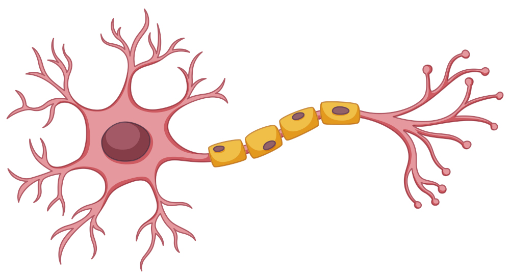

# 🧠 Simulador de Neurona Artificial

Aplicación web interactiva desarrollada con Streamlit que simula el funcionamiento de diferentes tipos de neuronas artificiales, desde modelos simples hasta más complejos.

https://neuronagarest.streamlit.app/



## ✨ Características

- Interfaz web intuitiva desarrollada con Streamlit
- Simulación de 3 tipos de neuronas:
  - Neurona simple (1 entrada)
  - Neurona con 2 entradas
  - Neurona con 3 entradas y sesgo
- Visualización de resultados en tiempo real
- Containerización con Docker para fácil despliegue

## 🛠️ Requisitos

- Python 3.8+
- Streamlit
- Docker (opcional)

## 📦 Instalación

### Local
```bash
# Clonar repositorio
git clone <url-repositorio>

# Instalar dependencias
pip install -r requirements.txt

# Ejecutar aplicación
streamlit run streamlit_app.py

# Construir imagen
docker build -t neurona-artificial .

# Ejecutar contenedor
docker run -p 8501:8501 neurona-artificial
```

## 📁 Estructura del Proyecto
.
├── streamlit_app.py    # Aplicación principal
├── requirements.txt    # Dependencias
├── Dockerfile         # Configuración Docker
├── neurona.jpg        # Imagen de la neurona
└── README.md         # Documentación

## 🚀 Uso
1. Seleccione el tipo de neurona en las pestañas superiores
2. Introduzca los valores de entrada según el modelo:
* Una entrada: valor x
* Dos entradas: valores x₁, x₂
* Tres entradas: valores x₁, x₂, x₃ + sesgo
3. Pulse el botón "Calcular"
4. Observe el resultado de la operación

## 📝 Fórmulas Matemáticas
* Neurona Simple: y = w * x
* Neurona Dos Entradas: y = w₁x₁ + w₂x₂
* Neurona Tres Entradas: y = w₁x₁ + w₂x₂ + w₃x₃ + bias

## 📄 Licencia
Este proyecto está bajo la Licencia MIT.
